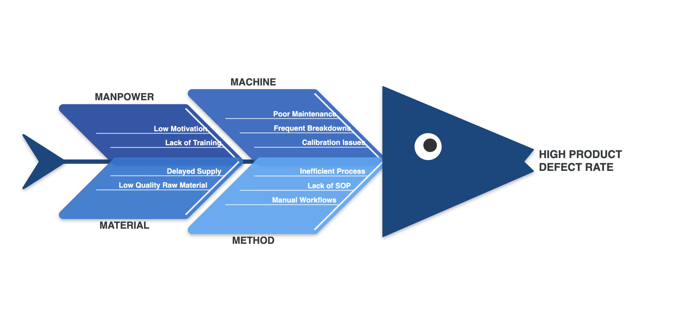
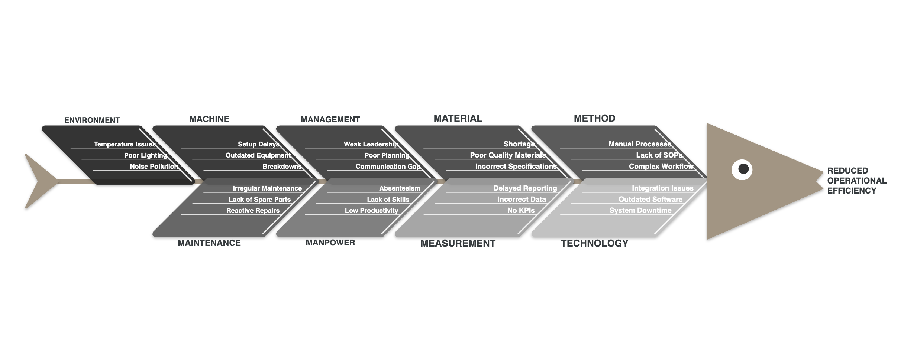
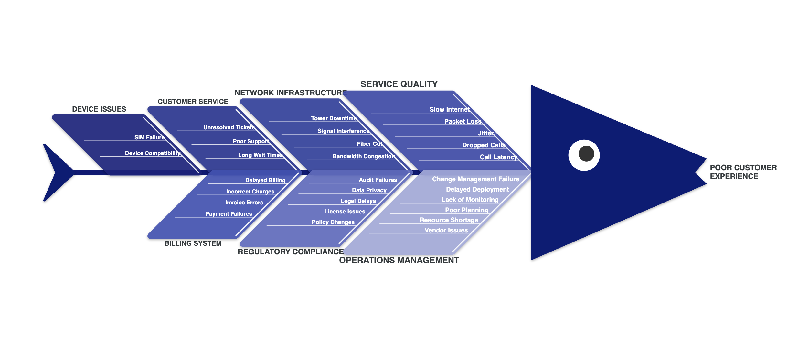

# 🐟 Fishbone Analysis — Power BI Custom Visual

🚀 A high-performance, fully dynamic Fishbone Analysis visual for Power BI, enabling deep root cause analysis with enterprise-grade scalability, interactivity, and modern UX.

## 🚀 Overview

The Fishbone Analysis visual helps users:

- Identify root causes of problems
- Categorize causes into structured groups
- Visualize relationships between causes dynamically

This visual is developed using:

- Power BI Custom Visuals API (v5.3.0)
- D3.js for rendering
- TypeScript for scalable logic


## 📸 Visual Preview

### ✅ Fishbone Example 1



### ✅ Fishbone Example 2



### ✅ Fishbone Example 3



## ✨ Features

### ✅ Dynamic Fishbone Layout

Automatically adjusts based on:

- Number of categories
- Number of sub-causes

Supports small to large datasets (up to 1000 rows)

### ✅ Interactive Capabilities

- **Hover** → Tooltip display
- **Click** → Category selection
- **Ctrl + Click** → Multi-selection
- **Right Click** → Context menu
- **Zoom & Pan** support
- **Double-click** to reset zoom

### ✅ Smart Color System

Supports 3 levels of color logic:

1. Manual category color mapping
2. Power BI theme palette
3. Fallback color palette

Optional:

- Global color override toggle

### ✅ Advanced Formatting

Full control from Power BI Format Pane:

| Setting | Description |
| --- | --- |
| Problem / Outcome Text | Fish head label |
| Show Title | Toggle visual title |
| Background Color | Visual background |
| Spine / Head / Tail Color | Structural design |
| Font Family, size, color | Category text styling |
| Category Text Styling | Separate customization |
| Bone Opacity | Transparency |
| Shadow Effect | Enable depth |
| Color Mapping | Manual category colors |
| Override Mode | Single color mode |

### ✅ Clean UX

- No tooltip duplication
- Zoom reset animation on double-click
- Keyboard focus on interactive bones (`tabindex`)
- High contrast support
- No text overlap

## 📊 Data Requirements

### Required Fields

| Field | Role |
| --- | --- |
| Main Cause | Category |
| Sub-Cause | Category |

### Optional Field

| Field | Role |
| --- | --- |
| Tooltips | Measure |

### Example Dataset

```csv
Main Cause,Sub Cause
Manpower,Lack of Training
Manpower,Low Motivation
Machine,Frequent Breakdowns
Machine,Poor Maintenance
Material,Low Quality Input
Method,Inefficient Workflow
```

## 🧠 How It Works

### Data Flow

```
Power BI DataView
        ↓
parseData()
        ↓
Group by Category
        ↓
Create Bone Pairs
        ↓
Layout Engine
        ↓
D3 Rendering
        ↓
User Interaction Layer
```

### Layout Logic

- Categories grouped into pairs (top & bottom)
- Dynamic spacing calculated using:
  - Category size
  - Number of sub-causes
- Bone sizes scale gradually (taper effect)

## 📁 Project Structure

```
fishbone-analysis-visual/
├── src/
│   ├── visual.ts              # Core rendering engine
│   └── settings.ts            # Format pane configuration
├── style/
│   └── visual.less            # Styling and UX
├── assets/
│   ├── icon.png
│   ├── thumbnail.png
│   └── screenshots/           # README preview images
├── dist/                        # Packaged .pbiviz (after npm run package)
├── capabilities.json
├── pbiviz.json
├── sample.pbix                  # Demo report
├── package.json
├── LICENSE
└── README.md
```

## ⚙️ Setup & Development

> **Note:** `pbiviz.json` uses a placeholder visual GUID (`FishboneAnalysisXXXXXXXXXXXXXXXXXXXX`). Before distributing your own build (especially to AppSource), generate a unique GUID with `pbiviz new` or the Power BI visuals tools and update `pbiviz.json`.

### Install dependencies

```bash
npm install
```

### Run locally

```bash
pbiviz start
```

### Build project

```bash
npm run build
```

### Package visual

```bash
npm run package
```

**Output:**

```
dist/FishboneAnalysisXXXXXXXXXXXXXXXXXXXX.1.0.0.0.pbiviz
```

Re-run `npm run package` after code changes to refresh the file in `dist/`.

## 📥 Download

👉 [Download pre-built visual](dist/FishboneAnalysisXXXXXXXXXXXXXXXXXXXX.1.0.0.0.pbiviz)  
Or grab the latest `.pbiviz` from [GitHub Releases](https://github.com/souravdas/fishbone-analysis-visual/releases) (when published).

## 📦 Usage in Power BI

1. Import `.pbiviz` file
2. Add visual to report
3. Assign fields:
   - **Main Cause** → Category
   - **Sub Cause** → Category
   - **Tooltips** → Optional
4. Configure settings from Format Pane

## ⚠️ Known Behavior

- Problem/Outcome text is controlled via format pane, not dataset
- Supports 2-level hierarchy (Category → Sub-cause)

## ✅ Pre-publish Checklist

- [ ] Visual loads without error in Power BI Desktop
- [ ] Tooltips and selection work per category
- [ ] Colors and bone override behave as expected
- [ ] Zoom, pan, and double-click reset work smoothly
- [ ] Layout scales across small and large category counts
- [ ] No overlapping text at common report sizes

## 🧪 Sample Report

A sample Power BI report demonstrating the visual:

👉 [Download sample .pbix file](sample.pbix)


## 💼 Business Use Cases

- Manufacturing defect analysis
- Root cause analysis in QA process
- Customer complaint categorization
- Supply chain issue breakdown


## 🔮 Future Enhancements

- Data-driven problem field
- Multi-level drilldown
- Animation transitions
- Export as image feature
- AppSource publishing

## 👨‍💻 Author

**Sourav Das**  
Analyst — Data & AI

## 📄 License

This project is licensed under the [MIT License](LICENSE).

## ⭐ Final Notes

This project demonstrates:

- ✅ Advanced D3 integration in Power BI
- ✅ Dynamic visual rendering logic
- ✅ Real-world business use case
- ✅ Production-ready custom visual architecture
